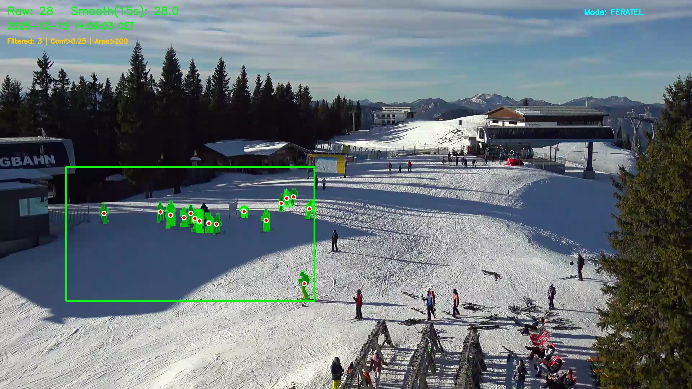

# Ski Lift Wait Time Estimator

Ein Computer Vision Projekt zur Schätzung der Wartezeit an Skiliften durch automatische Personenzählung mittels YOLOv11 Segmentation.

## 📋 Überblick

Dieses Projekt nutzt Deep Learning zur Echtzeitanalyse von Webcam-Streams an Skiliften. Das System detektiert und zählt Personen in einer definierten Region of Interest (ROI) und erstellt Visualisierungen sowie Logs für statistische Auswertungen.

**Hauptfunktionen:**
- Personendetektion mit YOLOv11 Segmentation
- Unterstützung verschiedener Video-Quellen (lokale Dateien, YouTube, Webcams)
- ROI-basierte Zählung mit automatischer Skalierung
- Zeitstempel-basiertes Logging (CSV)
- Live-Visualisierung mit Masken-Overlays

## 🚀 Quickstart

### Voraussetzungen

```bash
# Python 3.8+ erforderlich
pip install -r requirements.txt
```

### Ausführung

1. **Notebook öffnen**: `Ski_Lift_Wait_Time_Estimator_(Medium).ipynb`

2. **Zellen der Reihe nach ausführen**:
   - **Zelle 1**: Umgebungssetup (lokal/Colab)
   - **Zelle 2**: Optional - Datei-Upload (nur Colab)
   - **Zelle 3**: Hauptprogramm ausführen

3. **Programm läuft automatisch 2 Minuten** und stoppt dann

### Konfiguration (optional)

In [src/config.py](src/config.py) können Parameter angepasst werden:

```python
MODE = "bergfex"              # Videoquelle: "file", "live", "bergfex", "feratel"
MAX_SECONDS = 120             # Maximale Laufzeit in Sekunden
CONF_THRESHOLD = 0.25         # Detection Confidence (0.0-1.0)
BASE_ROI_X1, BASE_ROI_Y1 = 200, 500    # Region of Interest
BASE_ROI_X2, BASE_ROI_Y2 = 950, 900    # anpassen für andere Kameras
```

## 📁 Projektstruktur

```
├── Ski_Lift_Wait_Time_Estimator_(Medium).ipynb  # Haupt-Notebook
├── src/
│   ├── config.py          # Konfigurationsparameter
│   └── utils.py           # Utility-Funktionen (URL-Extraktion, ROI)
├── ski_cam_logs/          # CSV-Logs der Zählungen
├── screenshots/           # Auto-Screenshots bei hoher Personenanzahl
├── yolo11s-seg.pt         # YOLOv11 Segmentation Model
└── requirements.txt       # Python Dependencies
```

## 🔧 Funktionsweise

### 1. Video-Erfassung
- **File**: Lokale Videodatei
- **Live**: YouTube Live-Stream (via yt-dlp)
- **Bergfex**: Bergfex-Webcams (statisches Bild-Polling oder Stream)
- **Feratel**: Feratel WebTV Streams

### 2. ROI-Definition & Skalierung
Eine Region of Interest (ROI) wird auf Basis einer Referenzauflösung (2090×1164) definiert und automatisch auf die tatsächliche Stream-Auflösung skaliert.

### 3. Personendetektion
1. YOLO Segmentation detektiert Personen (Class 0)
2. ROI wird 2.5× hochskaliert für bessere Erkennung
3. Masken werden generiert und auf Original-Größe zurückskaliert
4. Kleine Fragmente werden gefiltert (< 200 Pixel)
5. Nur Personen mit Zentroid innerhalb ROI werden gezählt

### 4. Zählung & Logging
- **Raw Count**: Direkte Anzahl detektierter Personen
- **Smoothed Count**: Gleitender Durchschnitt über 15 Sekunden
- Output: CSV mit Timestamp, Counts, gefilterte Detektionen

### 5. Visualisierung
- Grüne Masken-Overlays für gezählte Personen
- ROI-Polygon als grüner Rahmen
- Live-Stats im Frame (Personenanzahl, Zeit, FPS)

## 📊 Output

### CSV-Log
Gespeichert in `ski_cam_logs/roi_counts_TIMESTAMP.csv`:

```csv
frame_idx,epoch_time,local_time,raw_count,smoothed_count,filtered_out_count
0,1702650123.45,2024-12-15 10:02:03 CET,12,12.0,3
1,1702650124.50,2024-12-15 10:02:04 CET,14,13.0,2
```

### Screenshots
Automatisch gespeichert in `screenshots/` wenn:
- Personenanzahl ≥ 20
- Min. 10 Sekunden seit letztem Screenshot



## ⚙️ Parameter-Tuning

Wichtige Parameter in [src/config.py](src/config.py):

| Parameter | Standard | Beschreibung |
|-----------|----------|--------------|
| `CONF_THRESHOLD` | 0.25 | Confidence für Detektionen (höher = weniger False Positives) |
| `MIN_MASK_AREA` | 200 | Minimale Pixelanzahl pro Person-Maske |
| `SMOOTH_WINDOW_SEC` | 15 | Glättungsfenster in Sekunden |
| `SCALE` | 2.5 | ROI-Upscaling für bessere Detektion |
| `MAX_SECONDS` | 120 | Maximale Laufzeit (2 Minuten) |

**Mehr Detektionen:** `CONF_THRESHOLD` senken (z.B. 0.20)  
**Weniger False Positives:** `CONF_THRESHOLD` erhöhen (z.B. 0.35), `MIN_MASK_AREA` erhöhen (z.B. 300)

